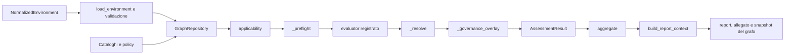

# Metodologia di valutazione

Questo documento descrive in modo sistematico come il sistema trasforma un
ambiente normalizzato in risultati tecnici tracciabili. Per ogni controllo la
metodologia risponde a quattro domande, nell'ordine: il controllo riguarda
l'asset? Le informazioni disponibili consentono di valutarlo? Quale stato
deriva dai fatti osservati? Quali elementi permettono di ricostruire la
decisione? La trattazione mantiene distinti decisione tecnica, governance,
aggregazione e presentazione.

## 1. Obiettivo e perimetro

Il prototipo valuta 26 regole asset-centriche riferite al sottoinsieme tecnico
selezionato delle Specifiche di base ACN. Cinque requisiti organizzativi sono
conservati nel catalogo come `manual_only`, senza controlli o regole eseguibili,
e non entrano nei conteggi tecnici. Il risultato riguarda i fatti rappresentati
nel dataset e non equivale a una certificazione o a un'attestazione complessiva
di conformità alla NIS2.

Il punto di partenza è un `NormalizedEnvironment` conforme al contratto dati
del progetto.
Il prototipo non acquisisce dati da sistemi operativi e non normalizza fonti
esterne: i moduli 1 e 2, cui spetterebbero questi compiti, non sono
implementati. La funzione di migrazione può completare alcuni metadati degli
input precedenti prima del caricamento, ma non è un modulo di acquisizione e
non inferisce mai `false` dall'assenza di un dato.

### 1.1 Contenuto dell'ambiente normalizzato

L'oggetto radice comprende:

- `DatasetInfo` e `Organization`, con fotografia temporale, profilo ACN e
  riferimento alla valutazione del rischio;
- `Asset`, `Service`, `Account`, `SoftwareComponent`, `Vulnerability`,
  `NetworkInterface`, `NetworkFlow`, `BackupRecord` e `SecurityCapability`;
- `ResponsibleParty`, `Process` e `DataObject`, usati per contestualizzare
  titolarità, dipendenze, criticità e dati trattati;
- `Evidence` e `ProvenanceRecord`, con origine, metodo, affidabilità, date e
  associazioni esplicite;
- `TechnicalException`, per deroghe tecniche e misure compensative;
- `Requirement`, `Control`, `Relationship` e `InventoryState`.

Le relazioni esplicite collegano le entità; gli identificativi presenti nei
campi tipizzati devono risolversi. `KnowledgeValue` distingue il valore dallo
stato di conoscenza (`known`, `unknown`, `not_applicable`, `conflicting`) e
registra tipo e data di osservazione, provenienze e causa dell'eventuale
incertezza. `InventoryState` dichiara se una collezione è `complete`,
`incomplete` o `unknown` entro uno specifico asset o dataset.

La qualità della valutazione dipende quindi dalla completezza, attualità,
corretta associazione e affidabilità dell'ambiente fornito. Il motore conserva
le lacune ma non può correggere a posteriori una raccolta incompleta o una
normalizzazione errata.

## 2. Funzione del Knowledge Graph

Il Knowledge Graph rappresenta le entità, le proprietà e le relazioni del
`NormalizedEnvironment`. Collega in particolare organizzazione, asset,
servizi, account, software, vulnerabilità, evidenze e provenienze; dopo il
caricamento include anche requisiti, controlli, regole e risultati.

La sua funzione nell'assessment è concreta e delimitata:

- offre al motore il repository unico dal quale recuperare asset e fatti
  pertinenti;
- rende interrogabili inventari, proprietà e relazioni del contesto valutato;
- conserva il collegamento dei risultati con le informazioni utilizzate;
- permette di ricostruire e interrogare la traccia dell'assessment.

Il grafo non decide gli esiti. `applicability()` determina il perimetro;
`_preflight()` ammette o scarta le evidenze e raccoglie lacune e conflitti; gli
evaluator producono fatti strutturati; `_resolve()` applica la policy
decisionale; `_governance_overlay()` determina separatamente la necessità di
revisione umana. Aggregazione e renderer descrivono risultati già calcolati.



## 3. Pipeline di assessment

`execute_assessment()` orchestra una sola pipeline condivisa da API, CLI,
Proof of Concept e scenari. `run_assessment()` aggiunge la scrittura dei tre
artefatti Markdown.

Il processo inizia con il caricamento dello YAML tramite `load_environment()`.
Il contenuto viene trasformato in un `NormalizedEnvironment` tipizzato e
mantiene l'identificativo del dataset e la fonte di input. Pydantic,
`validate_references()` e `validate_framework_alignment()` controllano quindi
schema, timestamp, unicità, riferimenti e allineamento tra requisito, controllo
e regola. Un errore in questa fase impedisce di eseguire l'assessment su dati o
cataloghi incoerenti.

Le evidenze sono classificate rispetto alla policy temporale. Quelle scadute
restano nel dataset, ma sono indicate come non utilizzabili e conservano il
motivo dell'esclusione. `populate_graph()` inserisce poi entità e relazioni,
mentre `populate_rules()` aggiunge le regole e i relativi legami. I dati
dell'esecuzione sono isolati mediante `graph_id`.

Il motore legge dal grafo l'organizzazione, il profilo NIS e le regole e
costruisce le coppie asset-regola da esaminare. Per ciascuna coppia,
`applicability()` considera profilo, rilevanza NIS, tipo di asset, condizioni
contestuali, selector e completezza degli inventari. Il risultato conserva il
motivo della decisione, le condizioni esaminate, le entità selezionate o
indeterminate e le eventuali lacune.

Quando la regola è applicabile, `_preflight()` controlla proprietà obbligatorie,
tipo e associazione delle evidenze, validità, provenienza e conflitti.
L'evaluator indicato dalla regola recupera quindi le entità dal grafo e produce
fatti valutati, ciascuno con valore osservato, stato, confronto, origine e
timestamp. Le condizioni sono aggregate secondo la policy dichiarata dalla
regola e, quando sono coinvolte più entità, i loro stati vengono combinati senza
eliminare violazioni, lacune o conflitti.

`_resolve()` determina lo stato tecnico e mantiene distinte le azioni
correttive dalle richieste di integrazione informativa. Il successivo livello
di governance esamina deroghe, rischi accettati e conflitti che richiedono
revisione senza riscrivere lo stato tecnico. Confidence, copertura informativa
e priorità operativa sono calcolate dopo la decisione e non sostituiscono
l'esito della regola.

Per ogni coppia asset-controllo viene infine creato un `AssessmentResult`, anche
quando il controllo non è applicabile. Il risultato viene inserito nello stesso
grafo e collegato ad asset, controllo, requisito e regola. La
`decision_trace` conserva i passaggi utilizzati. `build_report_context()`
costruisce la vista per il report principale, l'allegato tecnico e lo snapshot
del Knowledge Graph; i renderer presentano gli esiti ma non li rivalutano.

Le evidenze non subiscono una fase di raccolta nella pipeline. La
classificazione generale serve al reporting; il preflight della singola regola
decide quali evidenze possono partecipare alla specifica decisione.

## 4. Applicabilità e verificabilità

Le due nozioni rispondono a domande diverse.

L'**applicabilità** stabilisce se una regola riguarda una coppia
asset-controllo. Può produrre:

- `applicable`, quando il perimetro è certo;
- `not_applicable`, quando l'esclusione è certa;
- `undetermined`, quando manca una conoscenza necessaria a delimitare il
  perimetro.

Le esclusioni implementate comprendono profilo ACN non previsto, rilevanza NIS
nota e negativa, tipo di asset non ammesso, assenza certa di servizi Internet o
supporti rimovibili in un inventario completo, e nessuna entità certamente
selezionata. Se la rilevanza NIS, l'esposizione contestuale o la completezza
dell'inventario non sono note, l'applicabilità è `undetermined` e il risultato
tecnico diventa `not_verifiable`.

La **verificabilità** riguarda invece la sufficienza dei fatti e delle evidenze
per concludere su un controllo già applicabile. Il preflight non interrompe la
valutazione dei fatti disponibili: una violazione certa rimane quindi visibile
anche quando sono presenti altre lacune.

Un asset certamente esterno al perimetro NIS produce `not_applicable`. Se la
sua rilevanza NIS non è nota, il controllo è invece `not_verifiable` perché
l'applicabilità non può essere determinata. Per un controllo applicabile,
l'assenza o l'inammissibilità di un'evidenza obbligatoria produce
`not_verifiable` soltanto se non esistono violazioni certe. Una condizione
obbligatoria certamente falsa determina `non_compliant`; quando tutte le
condizioni obbligatorie sono soddisfatte, l'esito è `compliant`.

`not_applicable` non rappresenta mai una lacuna informativa.

### 4.1 Selector, inventari ed entità multiple

I selector `any` e `all` sono tri-state. `any` seleziona quando almeno un
confronto è vero, esclude quando tutti sono falsi e resta indeterminato negli
altri casi; `all` esclude se almeno un confronto è falso, seleziona se tutti
sono veri e altrimenti resta indeterminato.

Se esiste almeno un'entità selezionata, il motore valuta quella collezione e
conserva le entità indeterminate come lacune. Per una collezione vuota, un
inventario `incomplete` o `unknown` non prova l'assenza e conduce a
`not_verifiable`; con inventario `complete` si applica
`empty_collection_policy`. L'assenza di un perimetro contestuale può produrre
`not_applicable`, mentre l'assenza di record obbligatori può produrre
`non_compliant`.

Le condizioni sono raggruppate per entità. Le 26 regole correnti usano
`all_required` e `all_must_pass`: ogni entità pertinente deve soddisfare tutte
le condizioni obbligatorie. `RULE-PR-AA-05` valuta il minimo privilegio su
tutti gli account e la separazione amministrativa soltanto sugli account
privilegiati. Campi dichiarati informativi, come la centralizzazione eventuale
dei log in `PR.PS-04`, non determinano lo stato.

## 5. Evidenze e provenienza

`Evidence` dichiara tipologia, titolo, fonte, categoria, data di raccolta,
eventuale `valid_until`, affidabilità, contenuto, provenienze e associazioni ad
asset, servizi, vulnerabilità e controlli. `ProvenanceRecord` registra fonte,
metodo, categoria, data e affidabilità dell'informazione. I fatti osservati
rimandano a tali provenienze tramite `provenance_ids`.

Un'evidenza è candidata soltanto se la tipologia è richiesta dalla regola. È
ammessa alla decisione quando:

1. è associata sia all'asset sia al controllo correnti;
2. esiste una policy per la sua tipologia;
3. la raccolta non è futura e la validità non è scaduta;
4. fonte, categoria e provenienza sono presenti.

La scadenza effettiva è la più vicina fra `valid_until` e la finestra
`maximum_age_days`. Le policy correnti assegnano 30 giorni alla maggior parte
degli inventari e delle configurazioni tecniche, alle scansioni e ai registri
di trattamento; 90 giorni alle revisioni degli accessi e ai test di ripristino;
365 giorni alla gestione delle vulnerabilità, alla sicurezza fisica e ai
registri di manutenzione. Per i certificati è richiesta validità esplicita. Una
tipologia priva di policy, un'associazione errata, una validità indeterminabile
o una fonte scaduta sono registrate tra le evidenze scartate e non sostengono
un esito conforme.

Le fonti sono ordinate per categoria dalla policy della singola tipologia. A
parità di rango, contenuti discordanti producono un conflitto; la fonte più
recente prevale soltanto quando `prefer_latest_same_source` è abilitato. Un
conflitto su una condizione obbligatoria rende l'esito `not_verifiable` in
assenza di violazioni certe e richiede revisione di governance.

La presenza formale di un'evidenza non prova da sola la condizione tecnica, e
un'evidenza valida non cancella una violazione. Nei controlli
`evidence_assisted` il sistema verifica presenza, validità, provenienza,
associazione e coerenza formale; non sostituisce il giudizio esperto sulla
qualità sostanziale di documenti, procedure o misure.

## 6. Determinazione dello stato finale

Per le regole correnti la precedenza è conservativa:

1. tutte le condizioni obbligatorie soddisfatte producono `compliant`;
2. almeno una condizione obbligatoria nota e falsa produce `non_compliant`;
3. senza violazioni certe, una condizione obbligatoria mancante, sconosciuta o
   confliggente produce `not_verifiable`;
4. una violazione certa accompagnata da lacune o conflitti resta
   `non_compliant`, ma conserva simultaneamente violazioni, informazioni
   mancanti e conflitti;
5. un'esclusione certa nella fase di applicabilità produce `not_applicable`.

`partially_compliant` esiste nell'enumerazione per estensioni future, ma il
modello delle regole rifiuta `allow_partial` e nessuna delle 26 regole correnti
può emetterlo. Gli altri valori presenti nell'enumerazione generale non sono
stati prodotti dalla base sperimentale corrente.

La copertura informativa è il rapporto fra risultati applicabili tecnicamente
determinati e risultati applicabili totali; non è una percentuale di conformità.
Un risultato determinato deve inoltre avere fatti valutati o evidenze.

## 7. Stato tecnico e stato di governance

`technical_status` esprime la conclusione deterministica sui fatti tecnici.
`governance_status` vale `none` o `manual_review_required` e segnala una
decisione umana ancora necessaria. I due campi non si sostituiscono.

Una deroga attiva produce revisione manuale. Una deroga scaduta ma sostenuta da
evidenza corrente resta tracciata senza attivare la revisione; una deroga priva
di supporto corrente richiede invece revisione anche se scaduta. Per
`vulnerability_treatment`, un rischio accettato dichiarato sulla vulnerabilità
richiede revisione manuale. Anche i conflitti irrisolti la richiedono.

Il risultato conserva `technical_exception_id`; il grafo mantiene inoltre
motivazione, misura compensativa, rischio residuo, riferimento di approvazione,
scadenza, evidenze e provenienze. La revisione umana deve stabilire validità,
ambito, adeguatezza della misura compensativa e accettabilità del rischio
residuo, senza riscrivere automaticamente l'osservazione tecnica.

La confidence è distinta da entrambi gli stati. È `insufficient` in presenza
di lacune o conflitti; è ridotta da osservazioni dichiarate o fonti deboli e
aumenta con fatti diretti/derivati, evidenze e provenienze corroboranti. Non è
una probabilità di conformità.

## 8. Tracciabilità delle decisioni

La catena ricostruibile è:

```text
organizzazione → asset → controllo → requisito → regola → condizioni
→ fatti osservati → evidenze → provenienza → decisione
```

Ogni `AssessmentResult` identifica assessment, asset, controllo, requisito,
regola, profilo, punto ACN e modalità di verifica. Registra inoltre
condizioni e valori osservati, entità selezionate o indeterminate, evidenze
ammesse e scartate, provenienze, timestamp, lacune, conflitti, soglie, policy,
stato tecnico, stato di governance, confidence, motivazione della non
applicabilità, remediation e azioni informative.

### 8.1 Violazione certa: inventario hardware di Delta

Nel risultato `d2bbd3a2-691c-51f2-b049-9400e7eeaeaf` l'organizzazione sintetica
Manifattura Delta, profilo `essential`, collega `asset-delta-core` al controllo
`CTRL-ID-AM-01`, al requisito `REQ-ID-AM-01` e alla regola
`RULE-ID-AM-01`. L'applicabilità è soddisfatta. Il preflight
ammette `ev-delta-asset`; il fatto
`asset.hardware_inventory_complete`, osservato il 14 agosto 2026 e proveniente
da `prov-inventory`, vale `false` noto contro il valore richiesto `true`.
`all_required` determina quindi `technical_status=non_compliant`, senza lacune
o conflitti e con `governance_status=none`.

### 8.2 Informazione mancante: supporti rimovibili di Aurora

Nel risultato `8947f3c5-cb85-563e-9f24-2adf1e539e4d`, relativo ad
`asset-aurora-core`, `CTRL-PR-DS-01` e `RULE-PR-DS-01`, non esistono oggetti dati
che provino la presenza o l'assenza di supporti rimovibili e la completezza
dell'inventario `DataObject` non è nota. L'applicabilità contestuale è pertanto
indeterminata: `DataObject.inventory_status` resta tra le informazioni mancanti
e il risultato è `not_verifiable`, non `not_applicable`. Nessuna evidenza viene
ammessa e lo stato di governance resta `none`.

### 8.3 Revisione manuale: trattamento delle vulnerabilità di Delta

Per `RULE-ID-RA-08`, la vulnerabilità sinteticamente associata a
`asset-delta-core` ha `remediation_status=open`, osservato tramite `prov-patch`;
la regola produce `non_compliant` e conserva anche la lacuna sul monitoraggio
degli advisory. `accepted_exception=true`, dichiarato tramite
`prov-governance`, imposta separatamente
`governance_status=manual_review_required`: il rischio accettato non cancella
la violazione tecnica.
